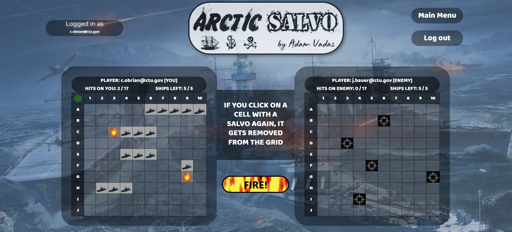

# Arctic Salvo 
> An online multiplayer battleship game

## Table of contents
* [General info](#general-info)
* [Technologies](#technologies)
* [Check it out!](#check-it-out)
* [Version History](#version-history)
* [Bugs to fix](#bugs-to-fix)
* [Contact](#contact)

## General info
Arctic Salvo is an online multiplayer battleship game for 2 players.
To play, you need to sign-up with an e-mail address of your choice. 
The game logic is based on the traditional board game called 'Salvo'. 
For general rules of a salvo-type game, please visit: https://www.thesprucecrafts.com/salvo-complete-rules-412378

## Technologies
* Java 11
* Spring Boot 2.3
* Maven 3
* HTML5
* CSS
* Vue.js

## Check it out!
<a href="#">Coming soon!</a>

## Version History
* Version 0.8.0 - works locally, built using Java 8 and Gradle 4.3 - 15 March 2019
* Version 0.8.1 - upgraded to Java 11, Gradle 5.6.2 and dependencies fixed - 10 September 2019
* Version 0.8.2 - changed to Maven and updated dependencies - 31 March 2020

## Bugs to fix
* Inference issues with repos
* Error message for insufficient password length does not fade after successful signup.

## Contact me
Created by [@adamvadas](https://www.linkedin.com/in/adam-vadas)
